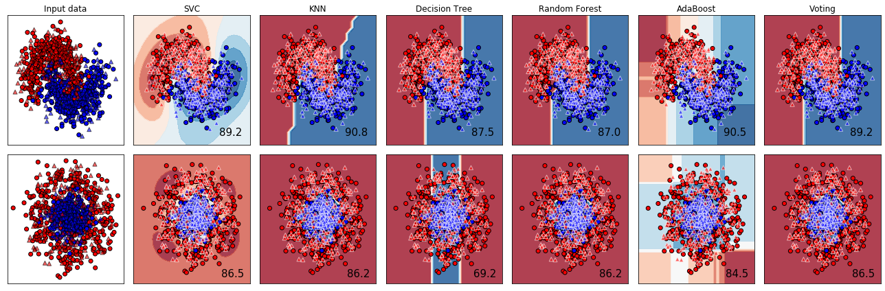

# Python-Ensemble-Learning-

</img> 

eng : In this project, skills such as Svm, Knn, Decision Tree were trained and performance results were recorded using the data sets we created. Later, community learning algorithms such as Random Forest, AdaBoost and Voting were trained and performance results were recorded, and these performance results were compared and analyzed.    
tr : Bu projede, kendi oluşturduğumuz veri setlerini kullanılarak  Svm, Knn , Decision Tree gibi algoritmalar eğitilerek başarım sonuçları kayıt edilmiştir. Daha sonra Random Forest, AdaBoost, Voting gibi ensemble learning (topluluk öğrenmesi) algoritmaları eğitilerek başarım sonuçları kayıt edilmiştir ve kayıt edilen bu başarım sonuçları karşılaştırılarak incelenmiştir. 

